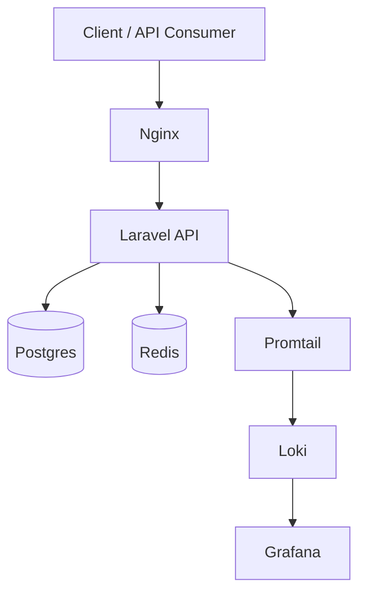

# Advanced API Guide

A production‑grade Laravel API showcase. The goal is simple: demonstrate the kind of API decisions that prevent outages, protect systems, and keep clients stable at scale.

## Why These Decisions Matter

**API versioning**
Breaking changes are inevitable. Versioning lets you evolve the API without breaking existing clients, and gives teams time to migrate safely.

**Unified response contract**
When responses are consistent, clients are predictable and tests are simpler. Every response carries `success`, `data/error`, and `meta` so integration is stable.

**Auth token flow**
Stateless auth is the backbone of scalable APIs. Token issuance + revoke is the minimum set to make authentication secure and manageable.

**Rate limiting**
Public APIs get abused. Rate limits protect your infrastructure and prevent brute‑force attacks without blocking legitimate users.

**Idempotency**
Network retries happen. Idempotency prevents duplicate side effects (e.g., double charges) by making write requests safe to repeat.

**Cursor pagination**
Offset pagination drifts when data changes. Cursor pagination is stable and fast for large datasets.

**Observability**
You can’t fix what you can’t see. Structured logs + dashboards make latency spikes and error bursts visible in minutes.

**OpenAPI + Redoc**
Good APIs are products. A living spec + docs is the fastest way to keep clients aligned with reality.

## Architecture Overview



## Architecture Notes

- **Edge control**: Nginx isolates public traffic, enabling request shaping and static caching without changing the app.
- **Stateless core**: Auth is token‑based; the API scales horizontally without shared session state.
- **Deterministic writes**: Idempotency is explicit at the endpoint level to avoid duplicate side effects.
- **Observability by default**: Logs are structured, metrics are explicit, and dashboards are pre‑wired for fast triage.
- **Schema as contract**: OpenAPI is treated as a product artifact, not an afterthought.

## Failure & Resilience Notes

- **Retry behavior**: Clients can safely retry write requests that use `Idempotency-Key`.
- **Idempotency TTL**: Keys are cached for 24 hours to balance safety and storage cost.
- **Metrics exposure**: `/api/metrics` is auth‑protected to avoid leaking internal service signals.
- **Slow endpoint purpose**: The `/slow` endpoint is included to validate latency monitoring and dashboard accuracy under controlled delay scenarios.

## What’s Included

- API versioning (`/api/v1`, `/api/v2`)
- Unified response contract (`success`, `data/error`, `meta`)
- Auth token flow (issue + revoke)
- Rate limiting and brute‑force protection
- Idempotency demo (`/payments`)
- Cursor pagination (`/users/cursor`)
- Observability stack (Loki + Promtail + Grafana)
- OpenAPI spec + Redoc UI

## API Docs

- OpenAPI spec: `/openapi.yaml`
- Redoc UI: `/docs`

## Observability

- Grafana: `http://localhost:3000` (admin / admin)
- Dashboards live under `docker/observability`

## Quick Start

```bash
cp .env.example .env
composer install
php artisan key:generate
php artisan migrate
npm install
npm run dev
```

Demo user (for auth flow):

```
email: demo@example.com
password: password
```

Docker (with observability):

```bash
docker compose --profile observability up -d
```

## Demo Endpoints

- `POST /api/v1/auth/token`
- `POST /api/v1/payments` (Idempotency-Key)
- `GET /api/v1/users/cursor`
- `GET /api/v1/slow?sleep_ms=1200`
- `GET /api/metrics`

## Tests

```bash
php artisan test
```

## License

MIT

## Load Testing (k6)

Minimal k6 scenarios that validate rate limiting, idempotency, and latency behavior.

```bash
# Auth rate limit (expect 200/401/429 mix)
k6 run k6/auth-rate-limit.js

# Idempotency (same Idempotency-Key repeated)
k6 run k6/idempotency.js

# Slow endpoint latency distribution
k6 run k6/slow-latency.js

# Error traffic (401 + 422) + slow endpoint
k6 run k6/error-traffic.js
```

Docker (no local k6 install):

```bash
docker compose --profile k6 run --rm k6 run /scripts/auth-rate-limit.js
docker compose --profile k6 run --rm k6 run /scripts/idempotency.js
docker compose --profile k6 run --rm k6 run /scripts/slow-latency.js
docker compose --profile k6 run --rm k6 run /scripts/error-traffic.js
```

Optional env vars:

```bash
export BASE_URL=http://localhost:8000
export K6_EMAIL=demo@example.com
export K6_PASSWORD=password
export IDEMPOTENCY_KEY=k6demo_idem_1234567890
```

Make targets:

```bash
make load-test
make load-test-auth
make load-test-idem
make load-test-slow
make load-test-errors
```
